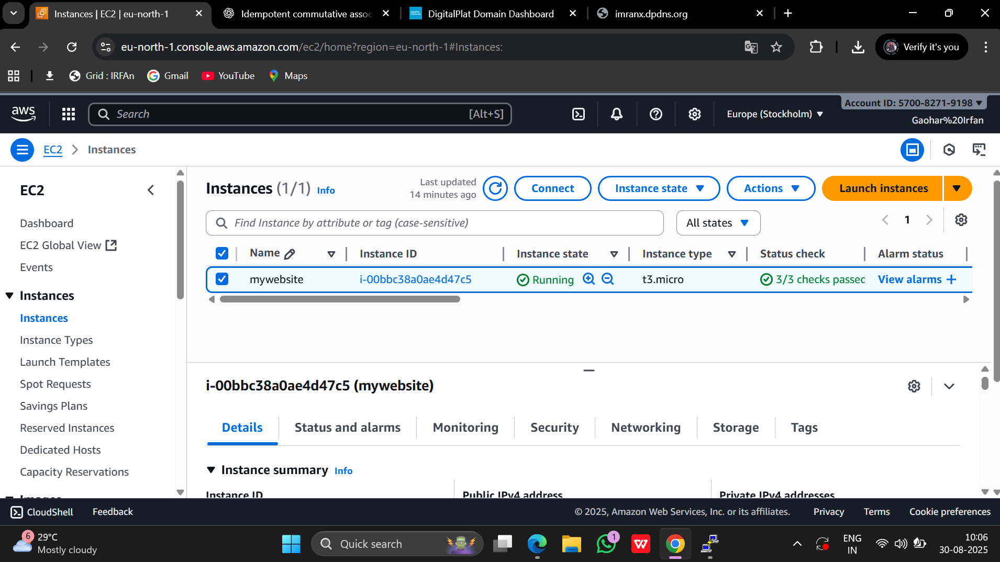
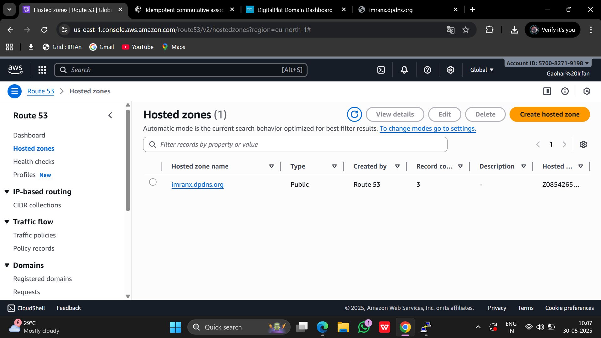
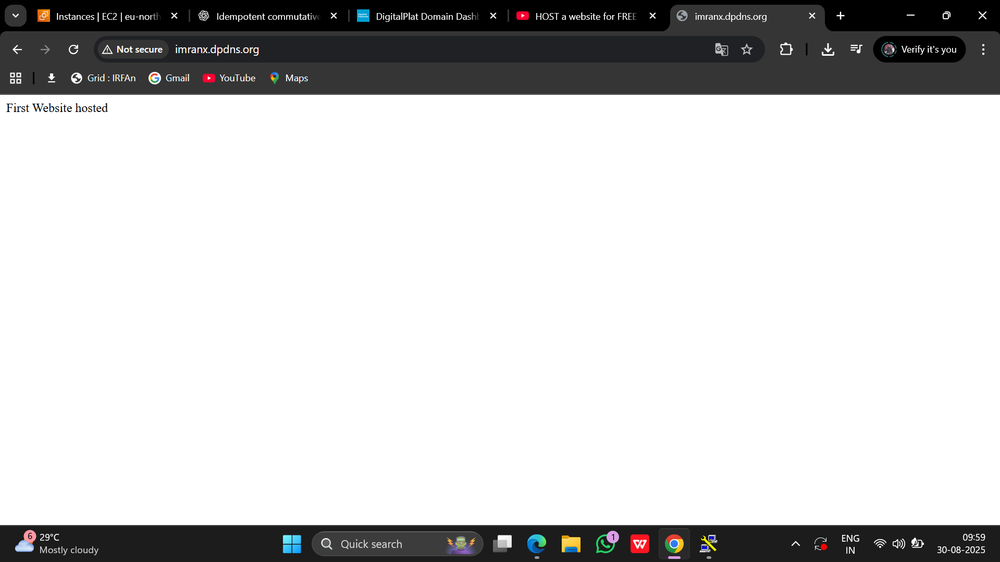
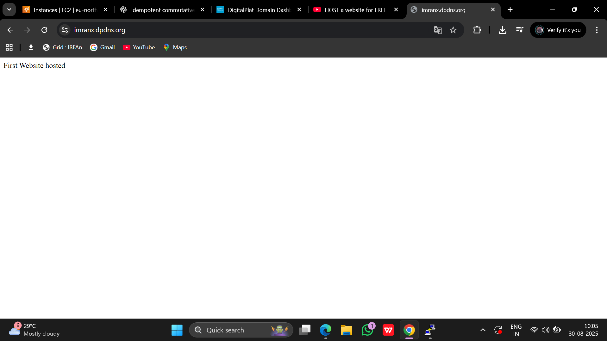

# 🌐 Hosting a Website on AWS EC2 with Route 53 and SSL  

## 🚀 Steps to Deploy

### 1. Launch EC2 Instance  
- Go to AWS Console → EC2 → Launch Instance  
- Choose **Ubuntu**  
- Create and Use key pair
- Use Putty
- Allow **HTTP (80)**, **HTTPS (443)**, and **SSH (22)**  
- Launch instance
## 🚀 Launched EC2 Instance



### 2. Connect to EC2 (using PuTTY/SSH)  
- Download Putty .exe file.
- Go to connection.
- Go to SSH
- Go to Auth
- Choose key pair file
```bash
login as username: ubuntu
```

### 3. Install Apache  
```bash
sudo apt install apache2
```

Check in browser → `http://yourpublicip`
- An Apache page will be shown to your public ip.

### 4. Upload Your Website Files  
```bash
cd /var/www/html
sudo rm index.html
sudo vi index.html
```
- Press I to insert your own html code.
- Write your own code.
- After writing all code , Press Ctrl+C and then write ":wq" and Press Enter.
- Upload your own `index.html` or project files. 

### 5. Map Domain with Route 53  
- Go to Route 53 → Hosted Zones
- You will get four NS name server.
## 🚀 NS Name Servers
  
- Then update these name server in your domain.
- Create **A record**
- Set your domain → Map with EC2 **Public IP**
## 🚀 Route 53 Hosted Zone

## 🚀 Website before SSL certfication (Showing Not Secure)


### 6. Enable SSL (HTTPS) using Certbot  
```bash
sudo apt install certbot python3-certbot-apache -y
sudo certbot --apache
```
- Then it will ask an email.
- Then it will ask your domain name , So just write it.
- Then SSl certification will deployed to your domain name.
  Check in browser → `http://yourpublicip`

## 🚀 Website after SSL certfication (Showing Secure)

